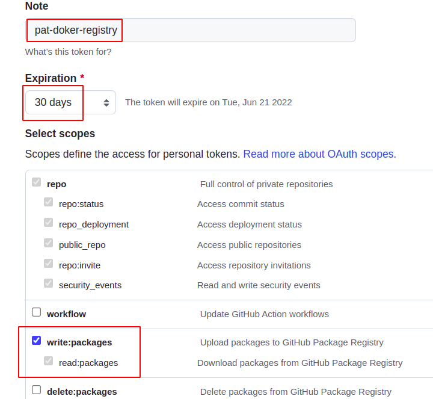

# Разворачивание сервиса в KNative

## Подготовка докре-образа

Докер-образ должен быть пердварительно сбилжен и виден в вашем локальном докер-хранилище. В случае Ktor-приложения это
делается командой

```bash
./gradlew :ok-marketplace-app-ktor:dockerBuildImage

# проверяем, что образ собрался
docker images
```

## Публикация докер-образа в реестре

Ваш докер-образ должен быть опубликован в каком-либо доке-реестре, например, в Docker Hub или Github Containers. В
последнем случае, вы должны создать PAT - personal access token на странице https://github.com/settings/tokens. При
создании необходимо правильно настроить права доступа:

Сгенерированный токен нужно сохранить в секретном месте без доступа других пользователей.

Далее, выполняем публикацию образа:

```bash
docker login ghcr.io -u <ваш guthub логин>
```

На запрос пароля нужно ввести не ваши github-пароль, а PAT, который вы созали выше. Далее публикуем наш образ.

```bash
docker tag ok-marketplace-app-ktor:latest ghcr.io/<github login или организация>/ok-marketplace-app-ktor:latest
docker push ghcr.io/<github login или организация>/ok-marketplace-app-ktor:latest 
```

## Установка minikube с knative

Нужно запустить скрипт [mini-knative-install](./mini-knative-install). В этом скрипте скачиваются необходимые программы,
затем запускается установщик minikube с knative:

```bash
kn quickstart minikube
```

Следующим шагом, мы настраиваем правильный профиль в minikube. По умолчанию, knative устанавливается в одноименный
профиль, тогда как minikube использует по умолчанию свой профиль "minikube".

```bash
minikube profile knative
```

## Добавление докер-реестра в knative

Нам необходимо сообщить knative учетные данные с которыми он должен получить наш докер-обриз. Для этого нужно настроить
скрипт [mini-knative-add-registry](mini-knative-add-registry), а именно вписать ваш email, имя пользователя и PAT. После
выполнения скрипта, knative сможет получать образы из нашего реестра.

## Разворачивание докер-образа в knative

Загрузка приложения в knative выполняется командой, указанной в [marketplace-install](marketplace-install):

```bash
kn service create marketplace \
  --image ghcr.io/otuskotlin/ok-marketplace-app-ktor \
  --port 8080
```

После ее выполнения, должны появиться такие строки:

```
Replacing service 'marketplace' in namespace 'default':

  0.049s Configuration "marketplace" does not have any ready Revision.
  0.093s ...
  0.113s Configuration "marketplace" is waiting for a Revision to become ready.
 48.337s ...
 48.412s Ingress has not yet been reconciled.
 48.465s Waiting for load balancer to be ready
 48.654s Ready to serve.

Service 'marketplace' replaced to latest revision 'marketplace-00002' is available at URL:
http://marketplace.default.10.105.229.193.sslip.io
```

Можно перейти по адресу http://marketplace.default.10.105.229.193.sslip.io и убедиться, что приложение выдаст
полагающийся "Hello, world!". 
